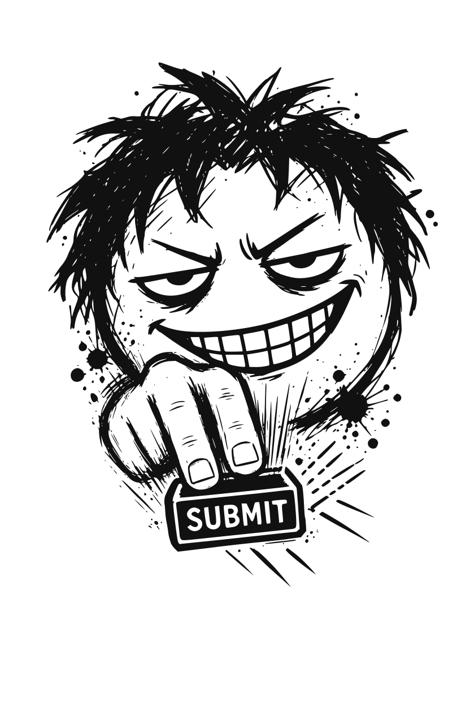

# buttonmasher

> *두 번 클릭할 수 있다면, 반드시 두 번 클릭할 겁니다.*

<p align="center"><picture><source media="(prefers-color-scheme: light)" srcset="assets/logo-light.svg"></picture></p>

**사용자는 설명서를 읽지 않습니다.**

공격자가 아닙니다. 당신 팀이 끝내 뽑지 않은 그 테스터입니다: 악의는 없고, 스피너를 기다려 줄 생각도 없을 뿐.

진짜 사용자가 결국 하게 될 방식으로 코드를 테스트하는 에이전트 스킬: 반복해서, 참을성 없이, 순서를 무시하고.

<sub><a href="README.md">English</a></sub>

---

```
두 번 클릭한다.
재시도한다.
새로고침한다.
중간에 끊는다.
빈 채로 보낸다.
같은 걸 또 보낸다.
순서를 바꾼다.
동시에 보낸다.

현실적인 상황에서 깨지면, 왜 깨지는지 설명한다.
수정이 작고 뻔하면, 고친다.
의미 있는 문제가 없으면, 내버려둔다.
```

## Before / after

결제 버튼을 배포했습니다.

```js
app.post("/api/checkout", async (req, res) => {
  const cart = await db.carts.find(req.body.cartId);
  const intent = await stripe.paymentIntents.create({ amount: cart.total });
  const order = await db.orders.insert({ cartId: cart.id, intentId: intent.id });
  res.json(order);
});
```

테스트는 통과했습니다.

그리고 buttonmasher가 등장합니다.

```
BUTTONMASHER

BROKE — 주문도 결제도 두 번

결제 버튼을 더블클릭했다.

요청 두 개가 90ms 간격으로 나갔다. 요청 중에도 버튼이 잠기지
않고, orders(cart_id)에는 유니크 제약도 없다. 결제 인텐트 둘,
주문 둘.

가장 작은 수정:
Stripe 호출에 idempotencyKey; 버튼에 disabled={busy}.
적용함, 3줄. orders(cart_id) 유니크 인덱스는 마이그레이션이라
제안만.

재테스트:
동시 POST 두 개 → 결제 하나.
```

예제 넷 더: [examples/](examples/) (영문). 진짜로 깨지는 걸 보고 싶으면 [demo/](demo/): 위의 그 엔드포인트를 실행 가능하게 만들고 동시 POST 두 개를 쏜 실제 출력이 있습니다. 수정 없음, 충분해 보이지만 아닌 수정, 그리고 진짜 수정.

## 하는 일

기능, diff, 엔드포인트, 웹훅 핸들러, 다단계 플로우, 혹은 레포 전체를 가리키면 됩니다.

buttonmasher는 정상 경로를 파악하고, 상태가 바뀌는 지점을 찾은 다음, **당신이 설계할 때 생각하지 않았던 바로 그 사용자처럼 행동합니다.**

- Submit을 더블클릭한다
- 서버에서는 이미 성공했는데 응답이 늦었다고 재시도한다
- 처리 중에 새로고침한다
- 뒤로가기를 누른다
- 같은 페이지를 탭 두 개에 띄운다
- 같은 웹훅을 두 번 보낸다
- 2단계를 건너뛰고 4단계로 간다
- 아무것도 입력하지 않은 폼을 제출한다
- 중간에 나갔다가 내일 다시 돌아온다

그리고 뭐가 깨졌는지, 왜 깨졌는지, 얼마나 큰 문제인지, 가장 작은 수정은 무엇인지 알려줍니다.

수정이 뻔한 몇 줄이면 직접 고치고 다시 테스트합니다.

아무것도 안 깨지면 네 줄로 그렇다고 말하고 코드를 내버려둡니다.

특히 잘 찾는 것:

- 중복 주문, 결제, 레코드, 이메일
- 생성 엔드포인트와 웹훅의 멱등성 누락
- check-then-insert 레이스
- 중간에 멈추거나 단계를 건너뛰면 깨지는 워크플로우
- 요청 처리 중에도 계속 눌리는 버튼
- 프론트엔드가 항상 얌전히 동작할 거라고 가정한 백엔드

## 하지 않는 일

- **퍼징 아님.** 깨진 JSON, 이상한 유니코드, 10MB짜리 페이로드는 관심 없습니다.
- **펜테스트 아님.** 공격자 모델은 없습니다. 사용자는 악의적이지 않습니다. 그냥 성급합니다.
- **유닛 테스트 생성 아님.** 버그를 재현하려고 테스트 하나쯤 쓸 수는 있지만, 테스트 스위트를 대신 만들어주진 않습니다.
- **카오스 엔지니어링 아님.** DB를 죽이거나 네트워크를 끊지 않습니다.
- **엣지 케이스 나열 아님.** 상상 속 시나리오 50개보다 현실적인 다섯 개를 찌릅니다.

필터는 질문 하나입니다:

> *성급하거나 헷갈린 실제 사용자가 여기서 할 법한 행동은 뭔가?*

악의적인 입력이나 인프라 장애가 있어야만 성립하는 시나리오라면 buttonmasher의 일이 아닙니다.

## 사용법

```
/buttonmasher src/api/checkout.ts
/buttonmasher 회원가입 + 이메일 인증 플로우
/buttonmasher src/                 # 코드베이스 전체: 경계를 순위 매겨 상위 다섯 개를 괴롭힘
/buttonmasher                      # 현재 diff를 괴롭힘
```

그냥 말로 시켜도 됩니다.

*"웹훅 핸들러 buttonmash 해줘."*
*"사용자가 이거 두 번 누르면 어떻게 돼?"*
*"이 엔드포인트, 재시도해도 안전해?"*

이런 요청이면 스킬이 알아서 켜집니다.

언제 돌리나: PR 올리기 직전, diff에. 코드가 아직 머릿속에 있고, 더블클릭이 아직 고객에게 일어나지 않은 유일한 순간입니다.

브라우저나 실행 중인 서버가 있으면 실제로 두 번 클릭하고, 실제로 요청을 두 번 보냅니다.

없으면 코드 경로를 따라가며 같은 상황을 분석하고, 실제 실행이 아니라 코드 분석이었다고 분명히 말합니다.

## 심각도

| 라벨 | 의미 |
|---|---|
| **BROKE** | 현실적인 사용자 행동으로 상태·데이터·돈이 잘못됐다. 재현됨. |
| **FRAGILE** | 재시도·타이밍·네비게이션에 따라 깨질 가능성이 높다. 아직 재현되진 않음. |
| **ANNOYING** | 사용 경험은 나쁘지만 상태는 정상. 언급만 하고 넘어감. |
| **BORING** | 살아남았다. 이게 원하는 결과. |

## 설치

### Claude Code 플러그인

```
/plugin marketplace add Nova-47/buttonmasher
/plugin install buttonmasher@buttonmasher
```

두 명령을 차례로 입력합니다. 새 세션을 열면 `/buttonmasher`가 있습니다.

### Codex / Copilot CLI

```
codex plugin marketplace add Nova-47/buttonmasher && codex plugin add buttonmasher@buttonmasher
copilot plugin marketplace add Nova-47/buttonmasher && copilot plugin install buttonmasher@buttonmasher
```

### SKILL.md를 읽는 모든 도구 (Cursor, OpenCode, Gemini CLI, ...)

```bash
git clone https://github.com/Nova-47/buttonmasher
cp -r buttonmasher/skills/buttonmasher ~/.claude/skills/      # Claude Code, 모든 프로젝트
cp -r buttonmasher/skills/buttonmasher .claude/skills/        # Claude Code, 이 프로젝트만
cp -r buttonmasher/skills/buttonmasher .agents/skills/        # Codex / Copilot, 이 프로젝트만
```

스킬은 마크다운 파일 하나와 참조 표 하나입니다. 훅이 없으니 포팅할 것도 없습니다. `SKILL.md`를 읽는 에이전트라면 이것도 읽습니다. Codex·Copilot 매니페스트는 ponytail 것을 그대로 따랐고, 이 레포에서 실제 설치는 아직 검증하지 않았습니다.

### 구성

```
buttonmasher/
├── .claude-plugin/          Claude Code 플러그인 + 마켓플레이스 매니페스트
├── .codex-plugin/           Codex 플러그인 매니페스트
├── .github/plugin/          Copilot CLI 플러그인 + 마켓플레이스 매니페스트
├── skills/buttonmasher/
│   ├── SKILL.md             스킬 본체: 무브, 워크플로우, 심각도, 수정 규칙, 리포트 형식
│   └── references/moves.md  경계 유형별 무브, 징후가 되는 코드 냄새, 흔한 수정
├── examples/                깨진 코드부터 수정까지 담은 리포트 다섯 개
├── demo/                    첫 화면의 그 엔드포인트, 실행 가능, 실제 출력 포함
└── assets/                  그 녀석: logo.svg, logo-light.svg, social-preview.png, 원본 jpg
```

훅 없음. 의존성 없음. 설정 없음.

스크립트는 데모뿐입니다. "두 번 클릭했더니 두 번 결제됐다"고 말하는 스킬이라면 그걸 보여줄 수 있어야 하니까요.

## 그냥 테스트나 카오스 엔지니어링과 뭐가 다른가

당신의 테스트에는 당신이 사용자가 할 거라고 *생각한* 행동이 들어 있습니다.

정상 경로를 만든 그 사람이, 같은 날, 같은 가정으로 테스트도 씁니다.

그리고 버튼은 한 번만 클릭합니다.

카오스 엔지니어링은 인프라를 부숩니다. 파드를 죽이고, 네트워크를 끊고, 디스크를 채웁니다.

유용합니다.

하지만 결제 버튼을 더블클릭한 사용자는 그런 짓을 하나도 하지 않았습니다.

인프라는 멀쩡했습니다.

**엔드포인트가 멱등하지 않았을 뿐입니다.**

buttonmasher는 그 사이를 노립니다.

인프라가 죽을 필요도 없고, 공격자가 나타날 필요도 없습니다.

느린 인터넷과 마우스를 가진 사용자 한 명이면 충분합니다.

그러니까, 당신이 결국 만나게 될 사용자입니다.

> **정상 경로는 낙관적입니다. 사용자는 아닙니다.**

## FAQ

**결국 "통합 테스트 쓰세요" 아닌가요?**

버그를 증명하려고 가끔 하나 씁니다.

하지만 가치는 테스트 파일 자체가 아니라, **어떤 다섯 가지 행동을 해봐야 하는지 아는 데 있습니다.**

**왜 퍼징은 안 하나요?**

어느 집 할머니도 40MB짜리 JSON을 보내진 않습니다.

더블클릭은 합니다.

퍼징은 기계가 만들어낸 기묘한 입력까지 넓게 뒤집니다. buttonmasher는 평범한 화요일 오후에도 충분히 일어나는 행동만 봅니다.

**아무것도 안 깨지면요?**

네 줄짜리 리포트와 오후 시간을 돌려받습니다.

**안 깨졌네요. 재미없군요. 좋습니다.**

그게 당신이 원하는 리포트입니다.

**제 코드를 "견고한 요청 파이프라인"으로 리팩터링하나요?**

아니요.

중복 제출 문제의 수정이 `disabled` 속성 하나와 유니크 인덱스 하나면, 거기서 끝입니다.

그보다 훨씬 많은 걸 고치자고 한다면,

코드에 문제가 하나보다 많았던 겁니다.

## 라이선스

[MIT](LICENSE)
